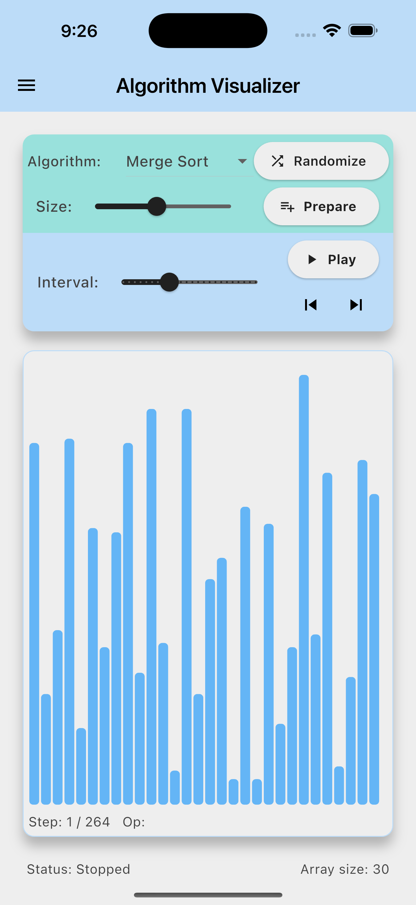

# 📊 Flutter Algorithm Visualizer

A Flutter-based application to **visualize algorithms step by step**
with interactive controls.\
Currently supports sorting (Merge Sort, Quick Sort) and string search
(Rabin--Karp).

------------------------------------------------------------------------

## 🚀 Getting Started

### 1. Create a new Flutter project

``` bash
flutter create algo_visualizer
```

### 2. Replace `lib/main.dart`

Copy the provided prototype code into your project:

    /algo_visualizer/lib/main.dart

### 3. Run the app

``` bash
flutter run
```

------------------------------------------------------------------------

## ✨ Features

-   **Algorithm Visualizations**
    -   Merge Sort (array bar visualization)
    -   Quick Sort (array bar visualization)
    -   Rabin--Karp (string search with rolling hash)
-   **Controls**
    -   Select algorithm
    -   Generate new array or input text
    -   Click prepare
    -   Play / Pause simulation
    -   Step forward / backward through frames
    -   Adjust playback speed with a slider
    -   Configure array size
-   **Highlights**
    -   Orange 🔶 → Comparing indices
    -   Red 🔴 → Swapped indices
    -   Green 🟢 → Match found (Rabin--Karp)

------------------------------------------------------------------------

## 🛠 Implementation Details

### Data Model

-   **Frame** → Snapshot of array state + metadata (e.g., indices being
    compared/swapped).
-   **RKFrame** → Snapshot for Rabin--Karp showing shift index and
    calculated hashes.

### Algorithm Instrumentation

-   Sorting algorithms work on a mutable copy of the array.
-   Each step produces a `Frame` added to the timeline.
-   Rabin--Karp records rolling hashes and window matches with
    `RKFrame`.

### Playback

-   The app steps through recorded frames like a **timeline**.
-   A `Timer` drives playback when running, or you can manually step.
-   Visualization:
    -   Sorting → Bars with height proportional to array values
    -   Rabin--Karp → Text highlighting + hash info display

------------------------------------------------------------------------

## 📌 Limitations & Notes

-   Designed as a **prototype for clarity** --- in production, split
    logic/UI into separate files and add tests.
-   Large arrays (\>120 elements) may cause high memory usage and slow
    rendering.

------------------------------------------------------------------------

## 📚 Tech Stack

-   **Flutter** (UI + logic)
-   **Dart** (algorithm implementations + frame recording)

------------------------------------------------------------------------

## 🚧 Future Improvements

-   Add more algorithms (DFS, BFS, Dijkstra, KMP, Heap Sort, etc.)
-   Save/load custom inputs
-   Dark/light themes
-   Export animations as GIFs/PNGs
-   Better performance for larger arrays

------------------------------------------------------------------------

## 📷 Demo (Optional Section)


